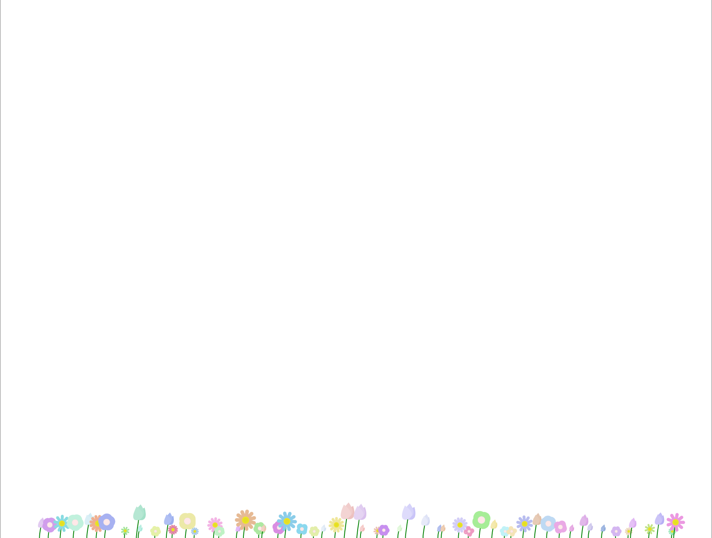

# Interactive Flower Animation

[Demo](https://flowers-gold-eight.vercel.app/)
### THIS README WAS GENERATED USING CLINE + CLAUDE-3.7-SONNET
A library that creates an interactive flower animation on an HTML canvas. The animation features different types of flowers that respond to mouse/touch interactions and sway gently in a simulated breeze.

### Desktop view


### Mobile view


## Features

- 🌷 Multiple flower types (Daisy, Tulip, DefaultFlower)
- 🖱️ Interactive flowers that respond to mouse/touch movement
- 🌬️ Gentle wind animation effect
- 📱 Responsive design that adapts to canvas size
- 🎨 Randomly generated pastel colors for flower variety

## Installation

```bash
# Clone the repository
git clone [repository-url]

# Navigate to the project directory
cd flowers

# Install dependencies
npm install

# Build the project
npm run build
```

## Usage

### JavaScript Version (Recommended)

Simply include the bundled JavaScript file in your HTML:

```html
<!DOCTYPE html>
<html lang="en">
<head>
    <meta charset="UTF-8">
    <meta name="viewport" content="width=device-width, initial-scale=1.0">
    <title>Flower Animation</title>
    <style>
        body, html {
            margin: 0;
            padding: 0;
            overflow: hidden;
            width: 100%;
            height: 100%;
        }
    </style>
</head>
<body>
    <!-- No need to create a canvas element, the library will handle it -->
    
    <!-- Load the bundled JavaScript file -->
    <script src="./dist/flowers.umd.cjs"></script>
    
    <script>
        document.addEventListener('DOMContentLoaded', () => {
            // Initialize the flower animation with default settings
            const renderer = FlowerCanvasRenderer.init();
            
            // Optional: To stop the animation when needed
            // renderer.stop();
        });
    </script>
</body>
</html>
```

### TypeScript Version

If you prefer to use the TypeScript version with ES modules:

```html
<!DOCTYPE html>
<html lang="en">
<head>
    <meta charset="UTF-8">
    <meta name="viewport" content="width=device-width, initial-scale=1.0">
    <title>Flower Animation</title>
    <style>
        body, html {
            margin: 0;
            padding: 0;
            overflow: hidden;
            width: 100%;
            height: 100%;
        }
        canvas {
            display: block;
            width: 100%;
            height: 100%;
        }
    </style>
</head>
<body>
    <canvas id="flowerCanvas"></canvas>
    
    <script type="module">
        import FlowerCanvasRenderer from './dist/index.js';
        
        const canvas = document.getElementById('flowerCanvas');
        canvas.width = window.innerWidth;
        canvas.height = window.innerHeight;
        
        const renderer = new FlowerCanvasRenderer(canvas, canvas.width, canvas.height);
        
        // Optional: Clean up when needed
        // function cleanup() {
        //     renderer.stop();
        // }
    </script>
</body>
</html>
```

## API Reference

### JavaScript API

#### FlowerCanvasRenderer

The main class that manages the flower animation.

```javascript
// Initialize with default settings (creates canvas automatically)
const renderer = FlowerCanvasRenderer.init();

// Or initialize with custom options
const renderer = FlowerCanvasRenderer.init({
    containerId: 'my-container',     // ID of container element (optional)
    canvasId: 'my-canvas',           // ID for the created canvas (optional)
    styles: {                        // Custom styles for the canvas (optional)
        zIndex: '10',
        filter: 'drop-shadow(0px 0px 1px #1d1d1d22)'
    }
});
```

**Options:**
- `containerId`: string (optional) - ID of the container element to append the canvas to
- `containerElement`: HTMLElement (optional) - Container element to append the canvas to
- `canvasId`: string (optional) - ID to assign to the created canvas element
- `styles`: object (optional) - Custom CSS styles to apply to the canvas

**Methods:**
- `stop()`: Stops the animation and removes event listeners

### TypeScript API

```typescript
const renderer = new FlowerCanvasRenderer(canvasElement, width, height);
```

**Parameters:**
- `canvasElement`: HTMLCanvasElement - The canvas element to render on
- `width`: number - The width of the canvas
- `height`: number - The height of the canvas

**Methods:**
- `stop()`: Stops the animation and removes event listeners

## Development

### Prerequisites

- Node.js (v14 or later)
- npm

### Development Commands

- `npm run dev` - Start the development server with hot reloading
- `npm run build` - Build the project for production

### Project Structure

```
├── dist/               # Compiled JavaScript files
├── src/                # Source TypeScript files
│   ├── Coords.ts       # Type definition for x,y coordinates
│   ├── Flower.ts       # Abstract base class for all flower types
│   ├── Renderable.ts   # Abstract base class with rendering utilities
│   ├── index.ts        # Main entry point with FlowerCanvasRenderer
│   └── flowers/        # Flower implementations
│       ├── Daisy.ts    # Daisy flower implementation
│       ├── DefaultFlower.ts # Default flower implementation
│       └── Tulip.ts    # Tulip flower implementation
├── index.html          # Demo HTML file
├── package.json        # Project configuration
├── tsconfig.json       # TypeScript configuration
└── vite.config.js      # Vite bundler configuration
```

## How It Works

1. The `FlowerCanvasRenderer` initializes the canvas and sets up event listeners for mouse/touch interactions.
2. Flowers are created at the bottom of the canvas, with the number of flowers adapting to the canvas width.
3. Each flower has a stem and a flower head, with the specific appearance determined by its class implementation.
4. The animation loop continuously updates and renders the flowers, applying wind effects and responding to mouse/touch position.
5. When the mouse/cursor is near a flower, the flower head is attracted to the cursor position.

## Extending

To create a new flower type:

1. Create a new class that extends the `Flower` base class
2. Implement the required `renderFlowerHead` method
3. Add your new flower class to the `flowerClasses` array in `FlowerCanvasRenderer`

Example:

```typescript
import Flower from "../Flower";
import type {Coords} from "../Coords";

class Rose extends Flower {
    // Custom properties
    
    constructor(position: Coords, mousePos: Coords) {
        super(position, mousePos);
        // Initialize properties
    }
    
    override renderFlowerHead(ctx: CanvasRenderingContext2D, wind: number) {
        // Custom rendering logic
    }
}

export default Rose;
```

## License

[MIT License](LICENSE)
